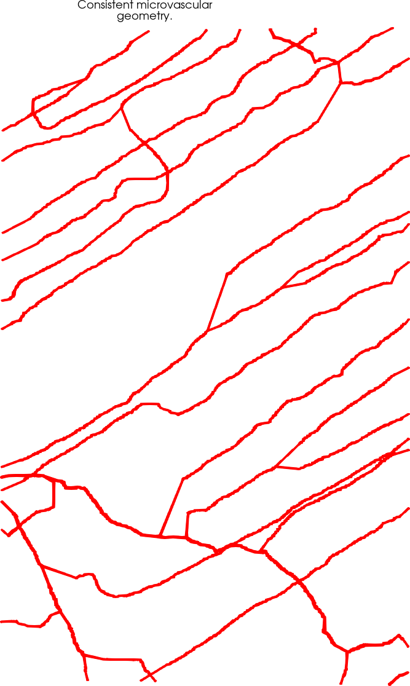

# Repository.

Analyzing microvascular IVVM imaging to extract network statistics.

# Background. 

This repo has the currently modest codes that convert manual segmentation into geometries suitable for CFD modelling.

# Dependencies.

* ImageJ for manual segmentation.
* MATLAB.
* Python.

# Use.

* ImageJ/FiJi is used to perform manual segmentation (see tutorial: shorturl.at/awGY1 ).
* Use the MATLAB and Python scripts in sequence to end up with a VTK file, which confirms the
connectivity, the morphometry, and the spatial distribution of the generated geometry. A frame from the time dependent imaging, 
and a generated geometry are shown below.  

Frame from video:

CFD suitable geometry:

# Uptake by other users.

This collection of files was developed specifically for a user requirement. Future functionalities are:  
* Automatic segmentation.
* Hematocrit (black spheres inside lumen) tracking for velocity.
* Generation of sythetic networks that have the same network properties (bifurcation angles, segment lengths, diameters).

# Licence.

These files are unavailable for opensource sharing.

## Dr. Sanjay R. Kharche, Ph.D. (App. Maths).  
January 23rd, 2023.  
Email: Sanjay.Kharche@lhsc.on.ca , skharche@uwo.ca , srk.london@yahoo.com .  
Phone: +15198780685 (mobile).  
Website: https://kcru.lawsonresearch.ca/research/srk/index.html  

